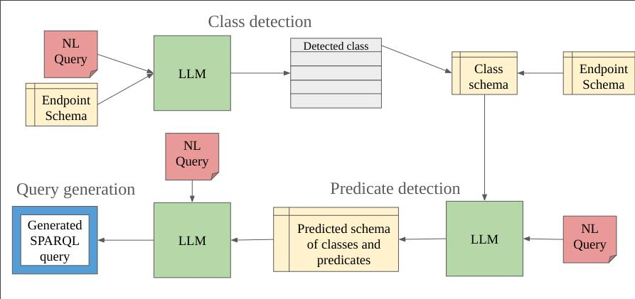
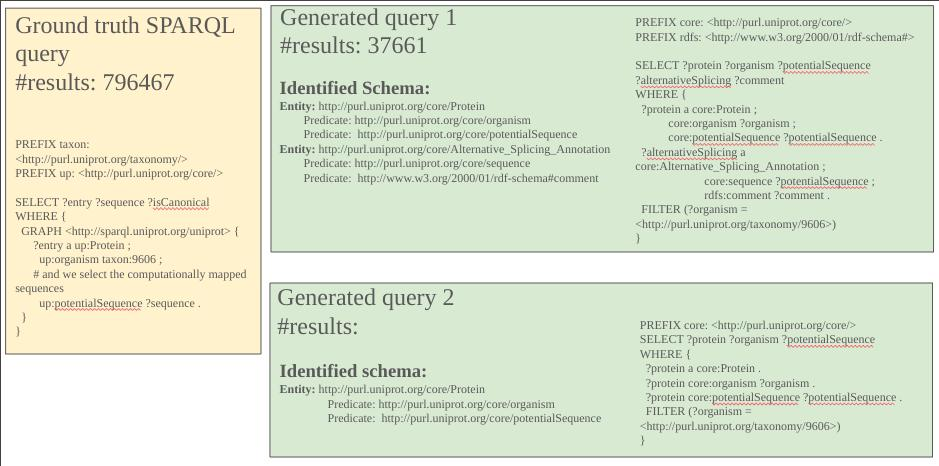

# reasoning-augmented-generation

Reasoning Augmented Generation - BH 2024


## Triple extraction
```
cd src
python pipeline.py "proteins that are involved the process of apoptosis"
```
Output

```
The extracted triple is: (bcl-2, involved, apoptosis)

Detected role:  involved -> part of
Detected class:  apoptosis -> Apoptosis modulation

OWL sentence: part of some Apoptosis modulation
```

## Schema extraction

Given a query in natural language and the schema of the SPARQL endpoint (for example Uniprot), we retrieve the schema of the query by interacting with the LLM in several steps:

* Class Extraction
* Predicate Extraction
* Query Generation





### Example

We show an example for the query: `List all Human UniProt entries and their computationaly potential isoforms.`



